# 스마트시티 AI 안전 기술 실무 과정

## 재직자 교육 과정 커리큘럼

---

## 📋 목차

- [스마트시티 AI 안전 기술 실무 과정](#스마트시티-ai-안전-기술-실무-과정)
  - [재직자 교육 과정 커리큘럼](#재직자-교육-과정-커리큘럼)
  - [📋 목차](#-목차)
  - [1. 교육과정 개요](#1-교육과정-개요)
    - [교수목표](#교수목표)
    - [산업현황 및 기업수요 조사](#산업현황-및-기업수요-조사)
    - [산업현황 분석](#산업현황-분석)
    - [기업수요 조사 결과](#기업수요-조사-결과)
    - [교육 요구사항 분석](#교육-요구사항-분석)
    - [교육 설계 주안점](#교육-설계-주안점)
  - [2. 교육과정 개요](#2-교육과정-개요)
    - [교육과정 기본정보](#교육과정-기본정보)
    - [모집 대상 현황](#모집-대상-현황)
    - [교육 핵심역량](#교육-핵심역량)
  - [3. 교육 일정](#3-교육-일정)
    - [교육 일정 개요](#교육-일정-개요)
    - [일차별 교육 내용](#일차별-교육-내용)
    - [세부 교육 내용](#세부-교육-내용)
  - [4. 교육 주제별 세부 강의 내용](#4-교육-주제별-세부-강의-내용)
    - [1일차: AI 전환(AX) 시대 활용 방법](#1일차-ai-전환ax-시대-활용-방법)
    - [2일차: Python 기반 기상 연계 사고 예측](#2일차-python-기반-기상-연계-사고-예측)
    - [3일차: YOLO 8을 활용한 시각 데이터 분석](#3일차-yolo-8을-활용한-시각-데이터-분석)
    - [4일차: 스마트시티 안전 AX 융합 비즈니스 모델 설계](#4일차-스마트시티-안전-ax-융합-비즈니스-모델-설계)
    - [5-6일차: AI 실무 프로젝트 구현](#5-6일차-ai-실무-프로젝트-구현)
    - [1 일차](#1-일차)
    - [2 일차](#2-일차)
    - [3 일차](#3-일차)
    - [4 일차](#4-일차)
    - [5 ~ 6 일차](#5--6-일차)
  - [5. 사용 데이터 및 실습 시나리오](#5-사용-데이터-및-실습-시나리오)
    - [강의 주제별 실습 배경](#강의-주제별-실습-배경)
    - [일차별 실습 목표](#일차별-실습-목표)
    - [사용 데이터 상세](#사용-데이터-상세)
    - [문제 해결 방안 탐색](#문제-해결-방안-탐색)
    - [실습 시나리오](#실습-시나리오)

---

## 1. 교육과정 개요

### 교수목표

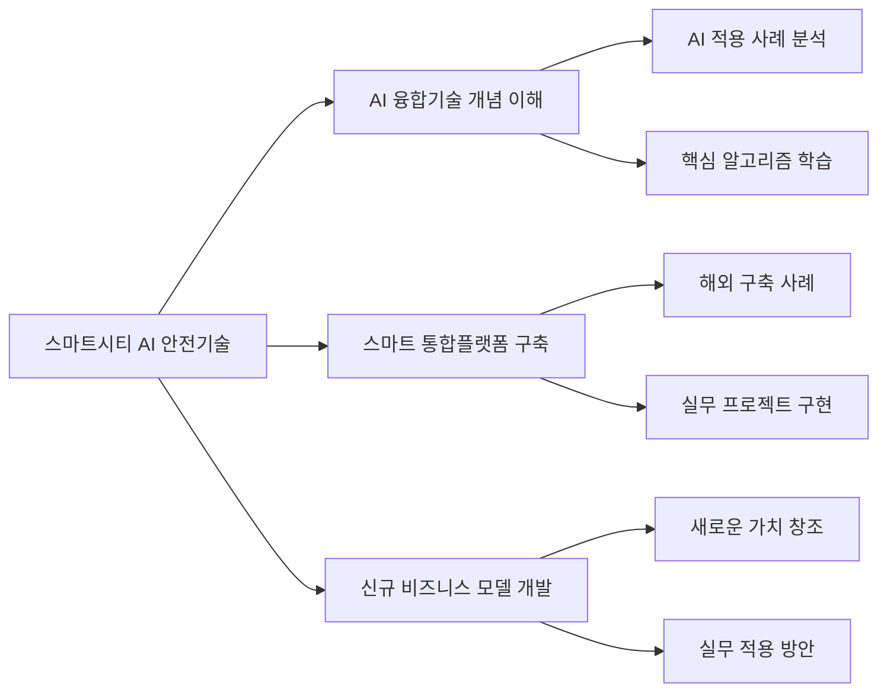

| 구분         | 교수목표                                                                                                                                                                              |
| ------------ | ------------------------------------------------------------------------------------------------------------------------------------------------------------------------------------- |
| **1차 목표** | 인공지능(AI)을 적용한 스마트 안전 분야의 AI 융합기술개념을 이해하고, 사례를 통해 AI융합기술이 적용되는 사항을 확인하여 스마트 통합플랫폼을 이해한다.                                  |
| **2차 목표** | 인공지능(AI)을 적용한 스마트 안전 분야의 AI 융합기술개념을 이해, 스마트 안전 구축 해외 사례, 인공지능 핵심 알고리즘 구현 학습 후 인공지능 적용 새로운 비즈니스 모델을 작성할 수 있다. |

### 산업현황 및 기업수요 조사

### 산업현황 분석

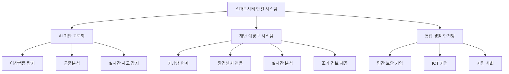

| 구분             | 시장 규모                 | 연도     | 비고        |
| ---------------- | ------------------------- | -------- | ----------- |
| **전 세계 시장** | 1,900억 달러 (약 250조원) | 2023년   | 현재 규모   |
| **전 세계 시장** | 4,000억 달러 (약 530조원) | 2030년   | 예측 규모   |
| **국내 시장**    | 7,000억원                 | 2024년   | 현재 규모   |
| **국내 투자**    | 4조원 이상                | 향후 5년 | 누적 투자액 |

### 기업수요 조사 결과

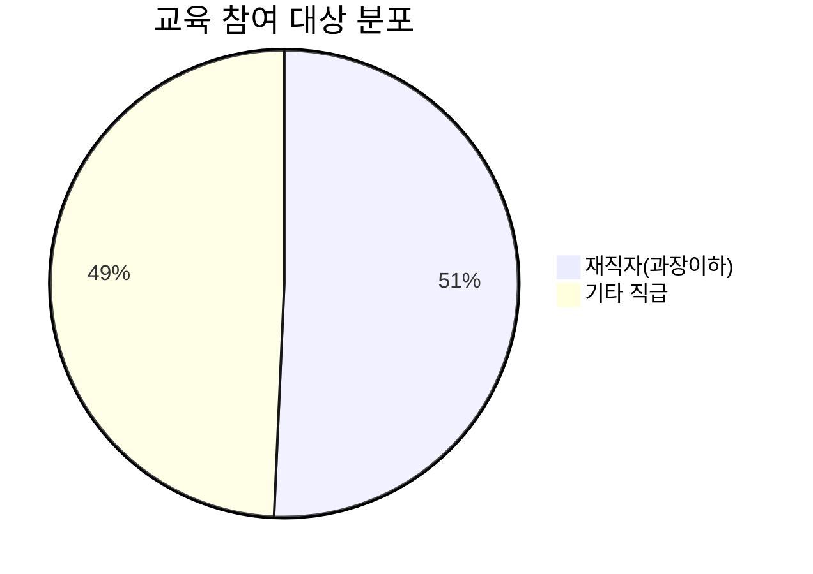

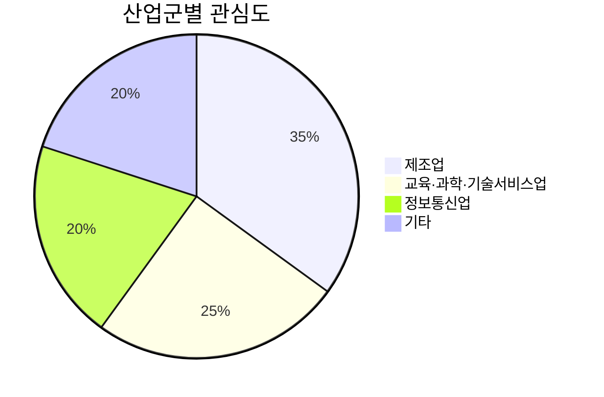

| 조사 항목            | 결과  | 비율  | 비고                            |
| -------------------- | ----- | ----- | ------------------------------- |
| **전체 응답자**      | 420명 | 100%  | 스마트시티 관련 산업분야 종사자 |
| **재직자(과장이하)** | 213명 | 50.7% | 주요 교육 대상                  |
| **스마트 안전 분야** | 87명  | 20.7% | 목표 업체 수                    |

### 교육 요구사항 분석

| 중요 요소            | 응답자 수 | 비율  | 교육 설계 반영사항         |
| -------------------- | --------- | ----- | -------------------------- |
| **실무 적용 가능성** | 327명     | 77.9% | 실무중심 실습과정 강화     |
| **체계적 커리큘럼**  | 174명     | 41.4% | 전문가 배정 및 단계별 학습 |

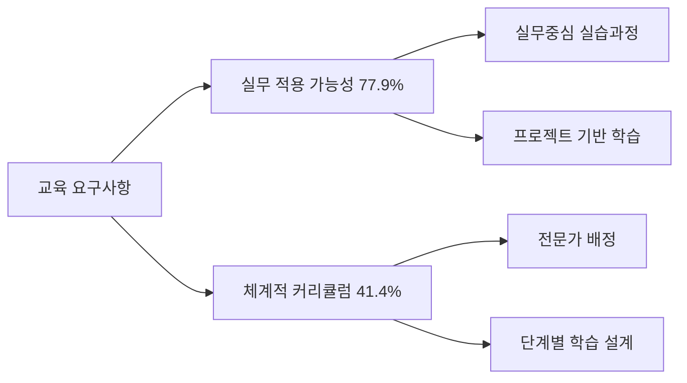

### 교육 설계 주안점

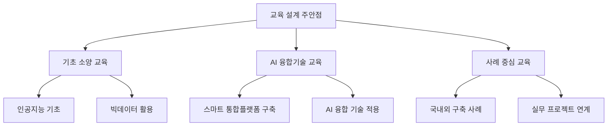

## 2. 교육과정 개요

### 교육과정 기본정보

| 구분         | 내용                                                |
| ------------ | --------------------------------------------------- |
| **교과목명** | 스마트시티 AI 안전 기술 실무 과정                   |
| **교육대상** | 스마트시티 안전 관련 기업 재직자 (3년 이상 경력자)  |
| **교육회수** | 2회                                                 |
| **수료기준** | 총 출석률 80% 이상                                  |
| **교육장소** | 장소미정                                            |
| **운영방식** | 오프라인(48H)                                       |
| **교육인원** | 정원 15-20명                                        |
| **평가여부** | -                                                   |
| **기타**     | 오프라인 실시간 교육 녹화 후 주말내 이수시 출석인정 |

### 모집 대상 현황

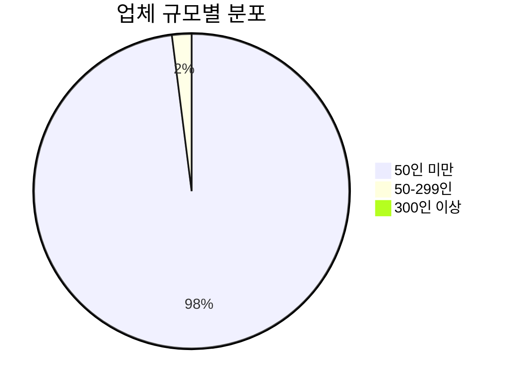

| 구분                | 업체 수  | 비율  |
| ------------------- | -------- | ----- |
| **전체 모집단**     | 94,796개 | 100%  |
| **50인 미만 업체**  | 92,768개 | 97.8% |
| **50-299인 업체**   | 1,853개  | 2.0%  |
| **300인 이상 업체** | 175개    | 0.2%  |

### 교육 핵심역량

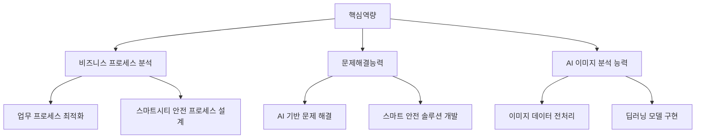

## 3. 교육 일정

### 교육 일정 개요

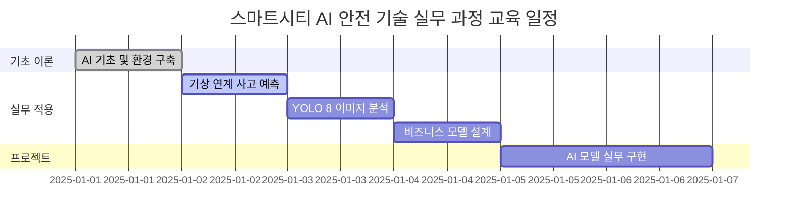

### 일차별 교육 내용

| 일차      | 주제                            | 강의내용                                                             | 시간 | 방식     | 비고               |
| --------- | ------------------------------- | -------------------------------------------------------------------- | ---- | -------- | ------------------ |
| **1일**   | AI 전환(AX) 시대 활용 방법      | • 인공지능 기초 개념 • 스마트시티 안전 사례 • Google Colab 환경 구축 | 8H   | 오프라인 | 이론(4H)+실습(4H)  |
| **2일**   | Python 기반 기상 연계 사고 예측 | • CNN, DNN 모델링 • 교통사고 예측 시스템                             | 8H   | 오프라인 | 실습(8H)           |
| **3일**   | YOLO 8 이미지 분석 딥러닝       | • 이미지 객체 검출 • 싱크홀 위험 예측                                | 8H   | 오프라인 | 실습(8H)           |
| **4일**   | 비즈니스 모델 설계              | • BM Canvas 작성 • AI 에이전트 활용                                  | 8H   | 오프라인 | 이론(2H)+실습(6H)  |
| **5-6일** | AI 실무 프로젝트 구현           | • Google Colab 활용 • 통합 시스템 개발                               | 16H  | 오프라인 | 이론(2H)+실습(14H) |

### 세부 교육 내용

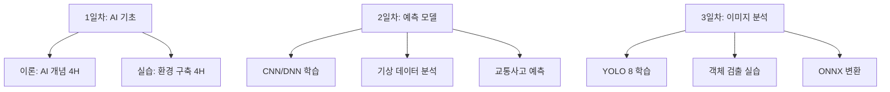

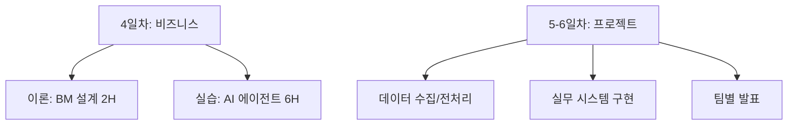

## 4. 교육 주제별 세부 강의 내용

### 1일차: AI 전환(AX) 시대 활용 방법

| 구분          | 내용                                                                                                                                                      |
| ------------- | --------------------------------------------------------------------------------------------------------------------------------------------------------- |
| **수업 목표** | • 스마트시티와 안전분야 AI 적용 및 산업의 미래를 이해 • 인공지능에 활용할 데이터와 분석 프로세스를 학습                                                   |
| **성취 기준** | • 인공지능의 개념, 활용처, 분석/개발 도구 및 원리 설명 가능 • 스마트시티 안전에 대한 이해와 인공지능 융합 이해                                            |
| **교수 방법** | 오프라인 교육: 이론(4H) / 실습(4H)                                                                                                                        |
| **강의 내용** | • 인공지능 전환(AX) - 시스템 최적화, 자원 관리 효율성 • 스마트시티 안전분야 AI 산업의 미래 • 데이터 분석 프로세스 및 전처리 • Google Colab 환경 구축 실습 |

### 2일차: Python 기반 기상 연계 사고 예측

| 구분          | 내용                                                                                  |
| ------------- | ------------------------------------------------------------------------------------- |
| **수업 목표** | • 스마트시티 내 날씨로 인한 안전 사고 예측 • AI 실무 프로젝트 구현                    |
| **성취 기준** | • 프로그램 이해도와 비즈니스 로직 이해 • 날씨, 교통 데이터를 활용한 사고 예측         |
| **교수 방법** | 오프라인 교육: 실습(8H)                                                               |
| **강의 내용** | • CNN, DNN을 이용한 기후변화 안전관리 • 교통사고 예측 시스템 구현 • 모델 학습 및 평가 |

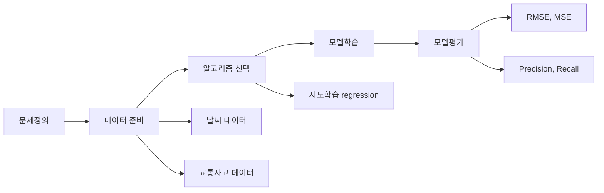

### 3일차: YOLO 8을 활용한 시각 데이터 분석

| 구분 | 내용 |
| ---- | ---- |**---------------------------------------------- |
| **수업 목표** | • 스마트시티 안전을 위한 시각 데이터 활용 • 이미지 분류 작업을 통한 AI 융합 이해도 향상               |
| **성취 기준** | • 이미지 분류 및 학습을 위한 CNN 이해 • YOLO 8을 활용한 객체 검출 이해 • ONNX 엔진으로 변환        |
| **교수 방법** | 오프라인 교육: 실습(8H)                                                                                  |
| **강의 내용** | • YOLO 8을 활용한 이미지 분석 • 싱크홀 위험 예측 모델 • 딥러닝 프레임워크 비교 • ONNX 변환 실습 |

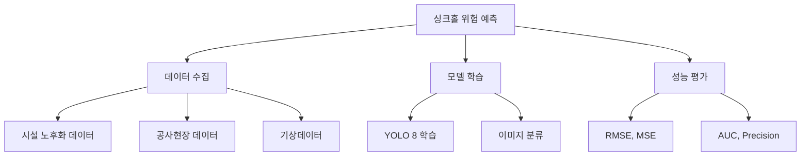

### 4일차: 스마트시티 안전 AX 융합 비즈니스 모델 설계

| 구분          | 내용                                                                                       |
| ------------- | ------------------------------------------------------------------------------------------ |
| **수업 목표** | • AI가 융합된 신규 BM 발굴 • 아이디어 구체화 및 비즈니스 모델 설계                         |
| **성취 기준** | • AI 학습 모델링과 실제 비즈니스 시각화 이해 및 실행                                       |
| **교수 방법** | 오프라인 교육: 이론(2H) / 실습(6H)                                                         |
| **강의 내용** | • 비즈니스 모델 설계 방법론 • BM Canvas 작성 실습 • AI 에이전트 활용 • 실무 적용 방안 토의 |

### 5-6일차: AI 실무 프로젝트 구현

| 구분          | 내용                                                                                                                        |
| ------------- | --------------------------------------------------------------------------------------------------------------------------- |
| **수업 목표** | • 실무에서 사용하는 AI 코딩 기술 • 스마트시티 안전 관련 실무 프로젝트 완성                                                  |
| **성취 기준** | • 실무 AI 코딩 방법과 학습파일 활용 • 시각화를 위한 Web 서비스 구축                                                         |
| **교수 방법** | 오프라인 교육: 이론(2H) / 실습(14H)                                                                                         |
| **강의 내용** | • 데이터 수집 및 전처리 • Python 기반 AI 실무 프로젝트 • Google Colab과 Streamlit을 활용한 시스템 구현 • 팀별 프로젝트 발표 |

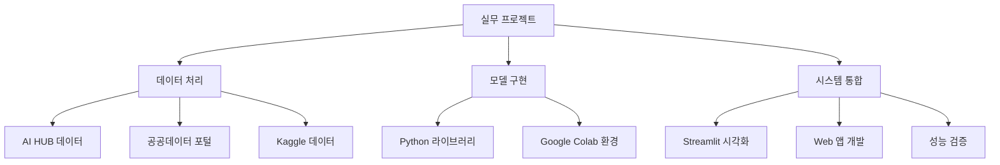

### 1 일차

 o 스마트시티와 안전분야 AI 적용 및 산업의 미래를 이해 o 인공지능에 활용할 데이터와 분석 프로세스를 학습 성취 기준 o 인공지능의 개념, 활용처, 분석/개발 도구 및 원리 설명 가능 o 스마트시티 안전에 대한 이해와 인공지능 융합 이해 교수 방법 o 오프라인 교육 o 이론(4H) / 실습(4H) 강의 세부 내용 o 인공지능 전환(AX)

- 시스템의 최적화, 자원 관리의 효율성 증대

- 시민 안전과 삶의 질 서비스의 향상

- 스마트시티와 안전분야 인공지능 산업의 미래

- 스마트시티와 도시 내 안전 인공지능

- 스마트시티를 위한 빅데이터와 AI 기술 주요 활용 분야 o 인공지능에 활용할 데이터와 분석 프로세스

- 분석의 목적, 데이터 수집, 데이터 분석, 데이터 전처리, 데이터 가공

- 인공지능 모델링 설계

- 데이터 형태에 따른 인공지능 알고리즘 이해 o 스마트시티 안전 사례 분석 실습(java 환경)

- 실무에서 사용 가능하게 환경 세팅

- 데이터 전처리, 후처리 기법, 산포도 분석 및 데이터 시각화

- 기상정보 표본 데이터로 선형, 비선형 예측 모델링

- 알고리즘별 인공지능 모델 정확도 비교 및 최적 알고리즘 선정 Python 기반 AI 모델을 활용한 기상 연계 사고 예측 실습

### 2 일차

 o 스마트시티 내 날씨로 인한 안전 사고 예측 해보기 o AI 실무 프로젝트 만들어보기 성취 기준 o 프로그램 이해도와 비즈니스 로직 이해 하기 o 날씨, 교통 데이터를 활용하여 사고 예측 교수 방법 o 오프라인 교육 o 실습(8H) 강의 세부 내용 o Python 환경에서 CNN, DNN을 이용한 기후변화에 따른 AI 안전관리 사전 사고(교 통, 홍수) 예측 하기

- Python으로 개발하는 안전분야 AI 실습

- 팀 별 회의를 통한 아이디어 선정 및 요구사항 정의

- 신규 비즈니스 모델 구상 및 실현 가능 여부 토의

- 공공데이터를 활용하거나 조별 논의된 데이터 수집 방법 확인(실 데이터 산출 /     수집, 데이터 전처리 및 임베딩(Embedding) 처리)     문제정의 데이터 준비^ 알고리즘 택 선 모델학습 모델평가     집중 호우시 사전 홍수지역 및 교통 사고 지역 피해 예측 1.날씨 데이터 2.지역별 교통 사고 데이터 지도학습 (regression) 학습:평가 80:20 RMSE^ MSE M RA 2 E AU CAC Precison Recall

### 3 일차

 o 스마트시티 안전에 대한 분류를 위한 시각 데이터를 활용해 보기 (이미지, 영상) o 스마트시티 안전에 대한 분류 작업을 통해 인공지능의 융합에 대 한 이해도 향상 성취 기준 o 이미지 분류 및 학습 방법을 위한 CNN의 이해 o 지역피해 표본데이터 통계를 바탕으로 지도학습 이해 o Python, YOLO 8 를 활용한 객체 검출에 대해 이해한다. o 모든 플랫폼에서 사용 가능하도록 ONNX 엔진으로 변환 교수 방법 o 오프라인 교육 o 실습(8H) 강의 세부 내용 o 영상(이미지), 지역피해 통계 데이터를 바탕으로 학습 및 데이터 전처리 후 학습 실행

- 문제 정의, 데이터 준비, 알고리즘 선택, 모델학습, 모델 평가 시나리오 작성

- AWS DJL, Python, YOLOv 8 를 활용해 이미지 속 객체를 검출

- CNN에 사용되는 활성화 함수(Relu 함수) 학습해 보기

- 데이터에 따른 학습 정확도, 손실 차이 보기

- 텐서플로우, 파이토치 학습을 통한 피해 규모 및 지역 예측     문제정의 샘플수집 모델학습 모델평가 장마철이나 집중호우 시 지하수가 증가하면서 싱크 홀 발생 위험이 높아 질 수 있습니다. 지하시설 노후화 및 건설 공사 지역을 사전 예측 해 보기 1.시설 노후화 데이터

1. 싱크홀 공사현장 데이터

2. 기상데이터     분류 (Classification) RMSE^ MSE M RA 2 E AUC Precis^ CAon Recall o 딥러닝 프레임워크의 비교 및 분석

- TensorFlow VS Keras VS PyTorch o DJL 및 ONNX Runtime으로 고성능 모델 추론 솔루션 구축

- ONNX 하이브리드 엔진으로 모든 플랫폼 사용 가능하도록 실무 테스트 및 검증 스마트시티 인전 AX 융합 새로운 Business Model 설계

### 4 일차

 o 회사의 제품 또는 서비스에 AI가 융합된 신규 BM을 발굴 o 제품 또는 AI 융합 서비스를 위하여 필요한 데이터 확보 o 아이디어를 구체화하여 비즈니스 모델로 설계 및 구현 성취 기준 o^ AI^ 학습^ 모델링과^ 실제^ 비즈니스^ 시각화^ 이해와^ 실행하기 교수 방법 o 오프라인 교육 o 이론(2H) / 실습(6H) o AI 데이터는 활용 및 회사 또는 개인 데이터 활용 강의 세부 내용 o 아이디어 구체화 및 비즈니스 모델 설계하기

- 비즈니스 모델 유형 설명 및 사례 소개

- 비즈니스 모델의 필요성

- 비즈니스 모델 정의 및 구성

- 비즈니스 모델 유형 및 사례

- BM 발표 및 상호토론 o AI에이전트를 활용하여 실제 사용 가능한 형태로 구현

- AI 융합된 새로운 가치 창조

- 실무 AI 코딩 방법

- 스마트 시티 기후 재난 안전 분야 AI 융합 비즈니스 모델 9 Canvas 작성 실습

- 팀 별 회의를 통한 아이디어 선정 및 요구사항 정의

- 신규 비즈니스 모델 구상 및 실현 가능 여부 토의

### 5 ~ 6 일차

 o 실무 에서 사용하는 AI 코딩 기술 o 스마트시티 안전 관련 실무 프로젝트의 완성 o 데이터를 수집 및 가공 후 인공지능 학습 할수 있다 성취 기준 o 실무 AI 코딩 방법과 학습파일 활용 o 시각화를 위해 App과 Server 만들기 교수 방법 o 오프라인 교육 o 이론(2H), 실습(14H) 강의 세부 내용 o 데이터 수집 및 전처리

- AI HUB, 공공데이터 포털, Kaggle, google에서 데이터 수집 방법

- 인공지능에 활용하기 위한 데이터 전처리 기법 o Java 기반 AI 실무 프로젝트 – Amazon DJL로 구현하는 안전분야 스마트 시스템

- 공공데이터를 활용하거나 조별 논의된 데이터 수집 방법 확인(실 데이터 산출 / 수집)

- ONNX 데이터 전처리 및 임베딩(Embedding) 처리

- 실무에서 사용할 수 있도록 개발 언어 설정 및 세팅

- 기업에서 즉시 적용할 수 있도록 AI 에이전트 만들기

- LLM 문자열을 위한 토큰 생성 및 사용 방법

- App, Web 환경에서 학습 데이터 사용 시각화

- 개인 또는 팀별발표 o 팀별 프로젝트 개발 성과 발표 및 에러 대응

- 실무에서 사용할 코드 주 요인이 되는 에러 찾기 및 대응

- 데이터 정의 및 전처리 설계

- 엔진별 비교 테스트(Tensorflow, Keras, PyTorch, DJL)

- 공통 엔진 ONNX로 모든 플랫폼에서 사용 가능하도록 만들기

- 테스트 데이터로 검증 분석 후 정확도 향상을 위한 모델 개선 및 데이터 전처리     진행

- 개선한 데이터와 모델을 통한 재학습 및 검증, 평가

- 학습된 모델을 사용한 이상행동 검출 시스템 개발

## 5. 사용 데이터 및 실습 시나리오

### 강의 주제별 실습 배경

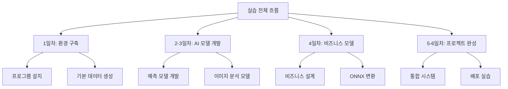

### 일차별 실습 목표

| 일차      | 실습 배경                                            | 실습 목표                                                            |
| --------- | ---------------------------------------------------- | -------------------------------------------------------------------- |
| **1일차** | 인공지능 실무 환경 세팅                              | • Google Colab 설치 및 환경 구축 • AI 기본 모델링 테스트 데이터 생성 |
| **2일차** | 집중 호우시 사전 홍수지역 및 교통사고 지역 피해 예측 | • 기상 데이터 활용 교통사고 예측 • Python으로 CNN, DNN 모델 구현     |
| **3일차** | 장마철 공사지역, 건물 노후화 데이터 기반 위험도 예측 | • 이미지 데이터 기반 위험 예측 • YOLO 8 객체 검출 실습               |
| **4일차** | 전처리, 토큰 처리, 플랫폼 적용                       | • 데이터 전처리 방법 학습 • ONNX 변환 및 플랫폼 적용                 |
| **5일차** | AI 코딩 기술 및 실무 프로젝트 활용                   | • 실무 AI 코딩 기술 습득 • 프로젝트 개발 역량 강화                   |
| **6일차** | 스마트시티 안전분야 AI 프로젝트 완성                 | • 통합 시스템 완성 • Google Colab과 Streamlit을 활용한 배포          |

### 사용 데이터 상세

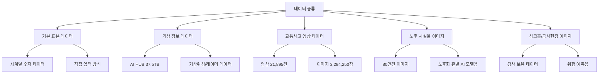

| 데이터명                   | 데이터 내용                           | 수집방법         | 규모                             | 형태                  |
| -------------------------- | ------------------------------------- | ---------------- | -------------------------------- | --------------------- |
| **기본 표본 데이터**       | 시계열 데이터 (숫자 데이터)           | 본인 직접 입력   | 100개 데이터                     | int, text             |
| **기상 정보 데이터**       | 기상위성, 기상레이더, AWS 관측 데이터 | AI HUB 다운로드  | 37.5TB                           | png, nc, uf, bin, csv |
| **교통사고 영상 데이터**   | 교통사고 과실비율 측정/평가 데이터    | AI HUB 다운로드  | 영상 21,895건 이미지 3,284,250장 | png, mp4              |
| **노후 시설물 이미지**     | 노후 시설물 판별 AI모델 학습용 이미지 | AI HUB 다운로드  | 80만건                           | 이미지/png            |
| **싱크홀/공사현장 이미지** | 싱크홀, 공사현장 이미지 데이터        | 강사 보유 데이터 | -                                | 이미지/png            |

### 문제 해결 방안 탐색

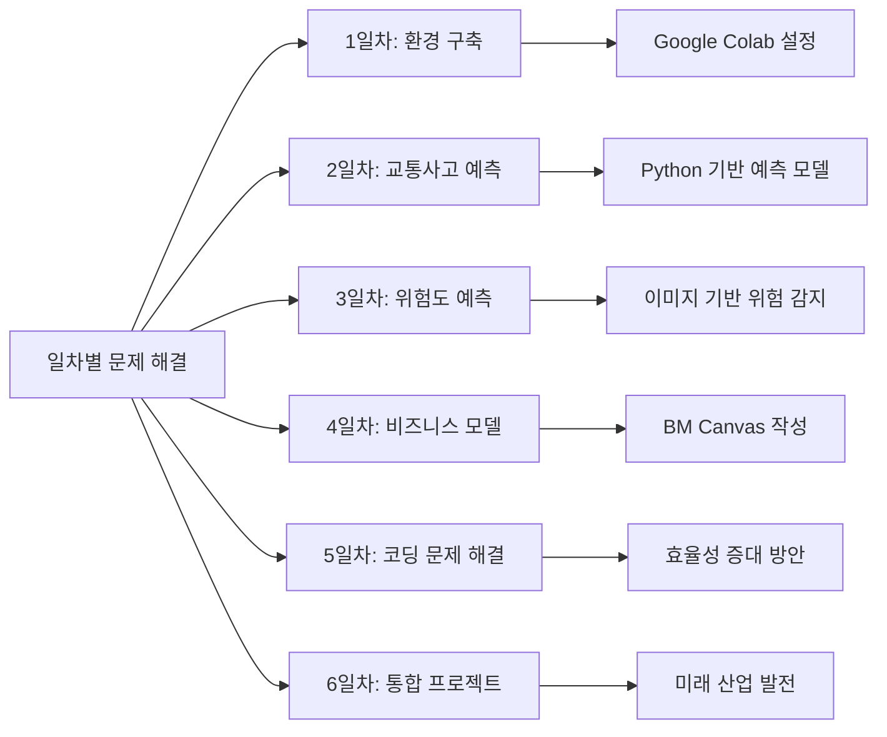

### 실습 시나리오

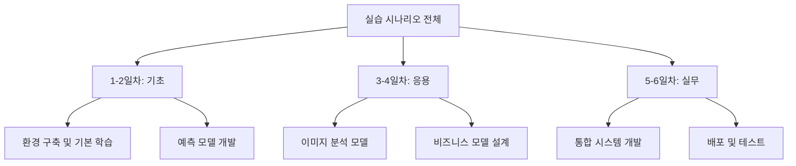

| 일차      | 실습 시나리오                                                                                                                      |
| --------- | ---------------------------------------------------------------------------------------------------------------------------------- |
| **1일차** | Google Colab 환경 구축 → 입력값 2개와 출력 1개를 사용한 표본 데이터 생성 → 정확도 학습 손실도 확인 → 교육생별 데이터 결과값 테스트 |
| **2일차** | 문제 정의 → 샘플 표본 데이터 수집 → Python 모델학습 → 학습 파일을 이용한 실제 테스트                                               |
| **3일차** | 문제 정의 → 이미지 데이터 수집 → YOLO 8 모델학습 → 객체 검출 테스트                                                                |
| **4일차** | 문제 정의 → 비즈니스 모델 설계 → BM Canvas 작성 → 실무 적용 방안 토의                                                              |
| **5일차** | 아이디어 취합 → Python 및 시각화 라이브러리 선택 → WEB, APP 개발 → 딥러닝 학습 → Streamlit 시각화 서비스 구현                      |
| **6일차** | 통합 테스트 → 에러 수정 → Google Colab 배포 → 개인 노트북, 웹 서비스 활용                                                          |
